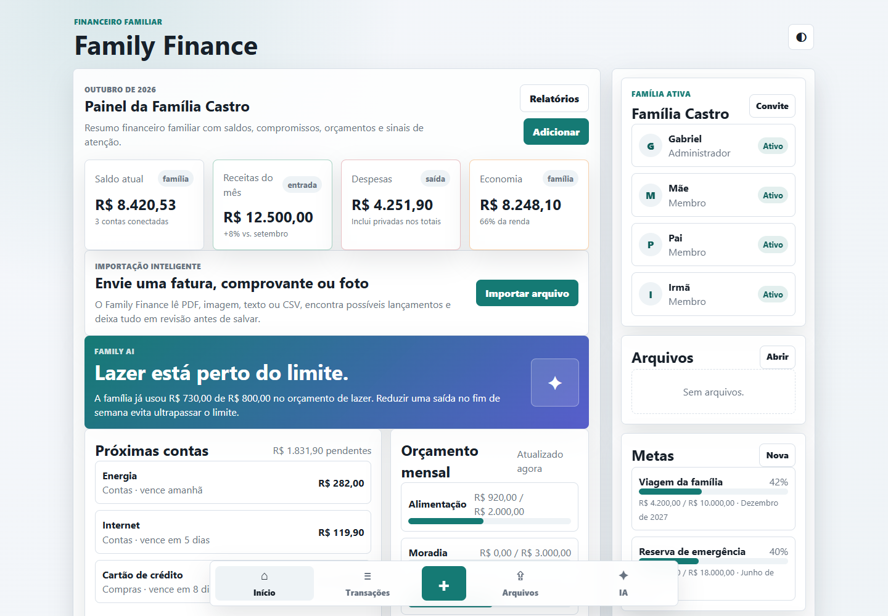
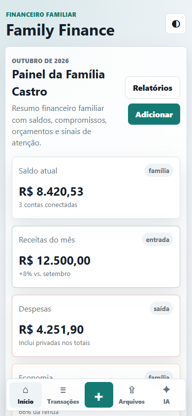

# Family Finance

**Projeto pessoal de organizacao financeira familiar**, com receitas, despesas, orcamentos, metas e importacao revisavel de faturas. Esta versao e um MVP web responsivo com persistencia no navegador.

**Responsavel pelo projeto:** [Gabriel Yuri Cavalcante de Castro](https://github.com/GabrielYuri1127).



<details>
<summary>Ver a interface no celular</summary>

</details>

## Objetivo

Reunir o acompanhamento das despesas da familia em um unico painel e reduzir o trabalho de digitar lancamentos a partir de faturas e comprovantes. O fluxo de importacao extrai texto, sugere transacoes e deixa a pessoa revisar o resultado antes de salvar.

| Aspecto | Descricao |
| --- | --- |
| Tipo | Projeto pessoal, em fase de MVP. |
| Interface | Aplicativo web responsivo para computador e celular. |
| Tecnologias | HTML5, CSS3, JavaScript, PDF.js e Tesseract.js. |
| Persistencia | `localStorage` para estado e IndexedDB para arquivos. |
| Execucao | Site estatico, sem etapa de build e sem backend nesta versao. |

## Funcionalidades Implementadas

- Painel com resumo de receitas, despesas e saldo.
- Cadastro de transacoes e organizacao por categoria, pessoa e conta.
- Orcamentos, metas e relatorios de acompanhamento.
- Alternancia entre temas claro e escuro.
- Importacao de PDF, imagem, TXT e CSV, com leitura de texto e OCR quando necessario.
- Revisao dos lancamentos sugeridos antes de incorporacao as transacoes.
- Armazenamento dos arquivos importados em IndexedDB no navegador.
- Assistente Family AI com regras locais para perguntas e propostas de lancamentos.

O assistente desta versao usa interpretacao por regras em JavaScript; nao esta conectado a um modelo generativo externo. Os nomes e valores iniciais servem a demonstracao da interface. Nenhuma fatura pessoal e incluida no repositorio.

## Como Executar

Requisitos: navegador moderno. Para servir por HTTP, use Python 3 ou um servidor estatico de sua preferencia.

```bash
git clone https://github.com/GabrielYuri1127/family-finance.git
cd family-finance
python -m http.server 8080 --bind 127.0.0.1 --directory dist
```

Abra `http://localhost:8080/`. A interface basica tambem pode ser aberta por `dist/index.html`, mas HTTP local e recomendado para workers de PDF/OCR e armazenamento do navegador.

A leitura de PDF e OCR carregam PDF.js e Tesseract.js por CDN. Esses recursos precisam de acesso a internet para carregar as bibliotecas e os modelos de reconhecimento.

## Como Testar A Importacao

1. Abra a area **Arquivos**.
2. Importe [`examples/fatura-demo.txt`](examples/fatura-demo.txt), que contem apenas dados ficticios.
3. Confira as descricoes, datas e valores sugeridos.
4. Confirme os lancamentos depois de revisar e verifique a area de transacoes.
5. Recarregue a pagina para conferir a persistencia no mesmo navegador.

## Organizacao Do Codigo

```text
dist/index.html        Estrutura da interface e navegacao
dist/styles.css        Estilos, temas e layout responsivo
dist/app.js            Estado, telas, transacoes, assistente e importacao
examples/              Arquivo ficticio para demonstracao
docs/                  Decisoes tecnicas e roteiro de apresentacao
```

Leia o [case tecnico](docs/case-study.md) para acompanhar as decisoes de implementacao e os limites do MVP.

## Limites Da Versao Atual

Os dados sao locais: nao existe sincronizacao entre aparelhos nem autenticacao real de membros. As opcoes de membro e visibilidade nao constituem controle de acesso. Limpar os dados do navegador pode remover transacoes e arquivos; esta base nao deve ser tratada como armazenamento financeiro definitivo.

O rotulo "Administrador" identifica um membro na interface, mas nao corresponde a um painel administrativo ou a permissoes no servidor. O botao de convite copia um codigo fixo de demonstracao; ele nao cria contas nem conecta outras pessoas aos dados.

A extracao de faturas e heuristica: formatos diferentes e OCR podem gerar resultados incompletos ou incorretos. O CSV e lido como texto pelo importador, sem suporte universal a todos os layouts. Revise os valores antes de salvar.

O resumo mensal e a data de referencia estao fixados em outubro de 2026 para esta demonstracao. A selecao dinamica do periodo permanece como melhoria futura.

## Verificacao Rapida

Com Node.js instalado, confira a sintaxe:

```bash
node --check dist/app.js
```

Depois valide cadastro de transacao, criacao de meta, importacao do exemplo, recarga da pagina e navegacao em computador e celular. A verificacao de sintaxe nao substitui testes desses fluxos. Veja o [registro da verificacao local](docs/validacao.md).

## Possibilidades De Evolucao

Os itens abaixo nao estao implementados nesta versao:

- Login e permissoes reais por membro da familia.
- Banco de dados e sincronizacao entre dispositivos.
- Backup e exportacao completos.
- Parsers especificos por formato de fatura e testes de extracao.
- Modularizacao de `app.js` conforme o crescimento da aplicacao.
- Integracao opcional com assistente generativo e versao Android.
